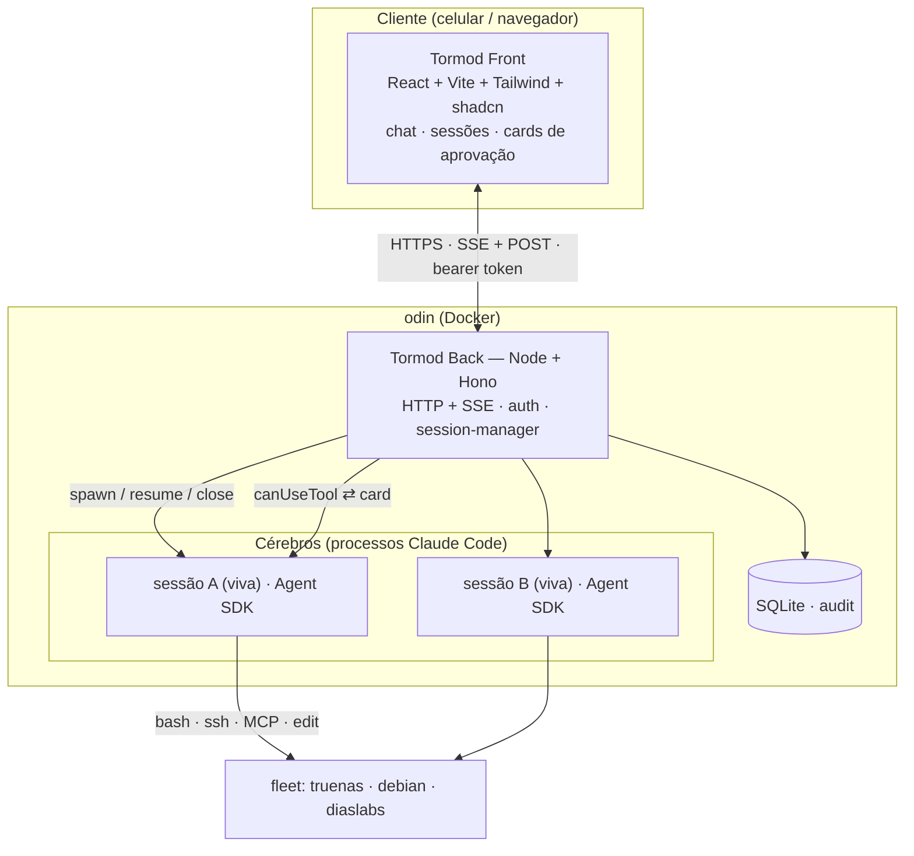
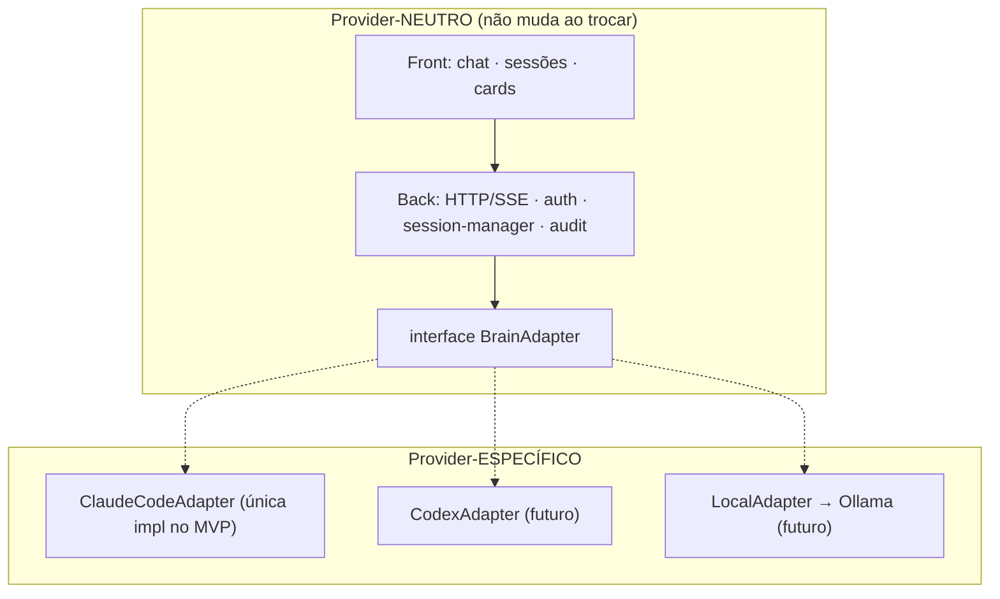
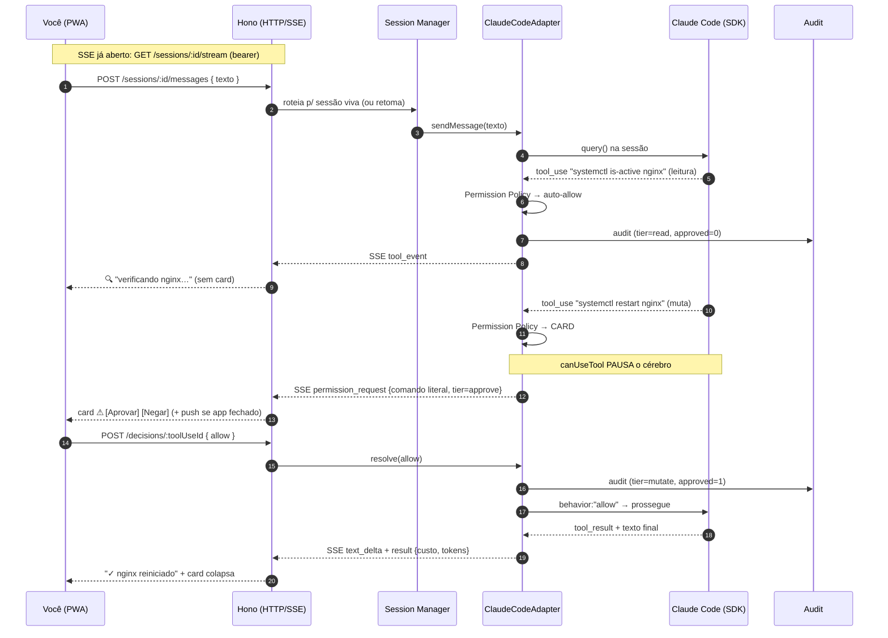
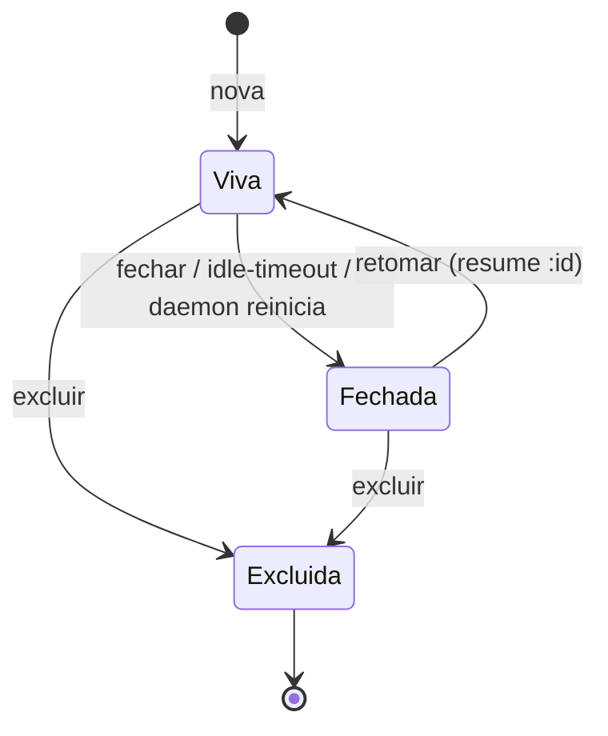
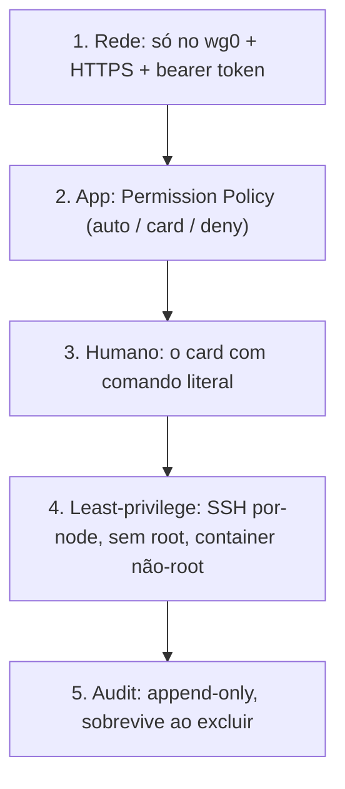

# Tormod — Design Spec

> *Tormod (Þórmóðr, "ânimo/mente de Thor") — a interface remota do homelab cujo hub se chama `odin`.*

- **Data:** 2026-06-08
- **Status:** aprovado (brainstorming) — pré-implementação
- **Supersede:** o `PRODUCT.md` antigo (concepção Huginn / MCP-de-ops-em-Go), que fica obsoleto. Ver §14 (mudança de concepção) e §16 (pendências).

---

## 1. O que é o Tormod

**Tormod é um app de homelab (front PWA + back daemon, Docker-native no `odin`) que deixa o usuário conversar com o Claude Code e gerenciar as sessões dele remotamente — pra operar o homelab do celular/navegador sem precisar dar SSH no `odin`.**

Os três papéis, limpos:

- **Front (a interface)** — chat, lista/gestão de sessões, cards de aprovação. Não tem lógica de ops nem fala com LLM.
- **Back (orquestrador fino)** — autentica, gerencia o ciclo de vida das sessões, faz a ponte SSE↔SDK, persiste audit. **Nunca chama LLM nem guarda API key.**
- **Cérebro (quem tem as mãos)** — processos Claude Code, dirigidos pelo **Claude Agent SDK**. Quem realmente pensa e age (bash/ssh/MCP/edit), reusando a auth e a config (`~/.claude`) que **já existem no `odin`**.

### Invariante de produto

> **O servidor é o produto; o cérebro é cliente.** O Tormod nunca embute "Claude-ismos" fora da fronteira `BrainAdapter` (§5). O back nunca conversa com o modelo — quem fala é o Claude Code, com a auth do `odin`. Isso mantém o Tormod provider-neutro e o cérebro trocável.

### O que muda no `odin`

O `odin` continua o que é (hub de admin, host do cérebro, dono das chaves SSH do fleet). O Tormod é **aditivo**:

1. Ganha **um container** (back + serve o front) — único serviço novo.
2. Ganha uma **porta remota e multi-sessão** pro cérebro que já morava lá.
3. As sessões passam a ser **compartilhadas pelo mesmo `~/.claude`**: dá pra começar algo no terminal (SSH) e retomar do celular, e vice-versa.

O que **não** muda: o usuário continua podendo usar o `claude` no terminal; o `odin` segue dono das chaves e do `.claude/`; a postura de confiança do lab não se altera (nenhuma chave migrou de lugar).

---

## 2. Escopo do MVP

- **Foco:** conversar com o Claude Code remotamente + gerenciar sessões + a camada de decisão (cards de aprovação).
- **Cérebro:** **só Claude Code** (via Agent SDK). Adapters adicionais ficam pro futuro (§13).
- **Transporte:** HTTP + SSE, atrás do WireGuard + bearer token + HTTPS.
- **Deploy:** container Docker no `odin`, desde o início do desenvolvimento.

### Não-objetivos (cerca do escopo)

| Fora do MVP | Onde vive |
|---|---|
| Adapters Codex / LLM local | Futuro (a fronteira já fica pronta) |
| Gestão de skills/memórias/agentes (config do `.claude/`) | Release futura |
| Dashboard / docs workspace / usage UI | Releases futuras |
| Multi-usuário com isolamento | É single-user (o dono); o bearer token = o usuário |
| Memória/histórico/métricas longas | Futuro microsserviço (ver §16, naming em aberto) |

---

## 3. Arquitetura



- **Roda no `odin`** porque é onde o cérebro precisa estar (SSH config do fleet, `~/.claude`, o `homelab-agent`). O container compartilha do host o necessário (montagens — §8).
- **Exposição:** HTTPS via `tormod.diaslabs.com.br` (terminado no edge existente do lab), atrás do **WireGuard** + bearer token. Zero exposição pública.

---

## 4. Componentes do back (Node/Hono)

| # | Componente | Responsabilidade única |
|---|---|---|
| 1 | **HTTP/SSE (Hono)** | rotas (`POST /sessions/:id/messages`, `GET /sessions/:id/stream`, `POST /decisions/:toolUseId`, `…/sessions` CRUD), middleware de auth, serve o front same-origin. |
| 2 | **Auth** | valida bearer token; só escuta atrás do WireGuard. (per-device na fase 2) |
| 3 | **Session Manager** | ciclo de vida: nova/listar/retomar/**fechar** (mata processo, mantém `.jsonl`)/**excluir** (apaga transcript). Mapeia `session_id ↔ adapter vivo`. Teto de simultâneas + auto-close por ociosidade. |
| 4 | **`BrainAdapter` + `ClaudeCodeAdapter`** | **a fronteira central** (§5). Pilota o Agent SDK e traduz as mensagens dele pro contrato neutro de eventos. Todo "Claude-ismo" mora só aqui. |
| 5 | **Permission Policy** | decide por tool: **auto-allow** (leitura segura) · **card** (muta estado) · **deny** (destrutivo). Onde a defesa contra injection é aplicada. |
| 6 | **Audit** | SQLite append-only; alimentado por hook `PreToolUse` + decisões. Não grava conteúdo de arquivo. |
| 7 | **Stream fan-out** | roteia eventos do adapter pro SSE certo por sessão; reconexão com `Last-Event-ID` sem perder eventos. |

---

## 5. A fronteira `BrainAdapter` (peça central)

O back fala com o cérebro **só** através de uma interface abstrata. Trocar de cérebro = escrever um novo adapter; nada acima da fronteira muda.



Esboço da interface (TS, ilustrativo — assinatura final na implementação):

```typescript
interface BrainAdapter {
  startSession(opts: SessionOpts): Promise<SessionHandle>;
  resumeSession(id: string): Promise<SessionHandle>;
  sendMessage(id: string, text: string): Promise<void>;
  close(id: string): Promise<void>;            // mata o processo, mantém transcript
  onMessage(cb: (e: BrainEvent) => void): void; // text_delta · tool_use · result · error
  onPermissionRequest(cb: (req: PermissionRequest) => Promise<PermissionDecision>): void;
}
```

- `onPermissionRequest` é o `canUseTool` do SDK por trás — **assíncrono, pausa o cérebro até a decisão chegar** (pode esperar minutos).
- `onMessage` emite o **contrato neutro de eventos** — o front não sabe que cérebro está embaixo.
- **Testabilidade:** um `FakeBrainAdapter` implementa essa interface e deixa testar o app inteiro sem chamar LLM (§11).

---

## 6. Fluxo de dados (uma mensagem ponta-a-ponta)

Cenário: *"reinicia o nginx no truenas se ele tiver caído"*.



Pontos:

- **Dois canais:** SSE (servidor→cliente: texto, tool events, cards, resultado) + POSTs (cliente→servidor: mandar mensagem, responder card). Modelo nativo de streaming, sem WebSocket.
- **Decisão assíncrona e desacoplada no tempo:** o `canUseTool` pausa o cérebro até o `POST /decisions/:toolUseId`. O `toolUseId` casa o card com a decisão.
- **Leitura não gera card; mutação gera.** Toda passagem pela policy grava no audit.
- **Reconexão sem perda:** SSE volta com `Last-Event-ID`; o fan-out reemite o perdido. **O cérebro segue vivo offline** — um card pendente continua esperando (e o push chamou).
- **Multi-sessão:** mesmo fluxo, N vezes, independentes.

---

## 7. Sessões e gestão de processos



| Estado | O que existe no `odin` | Custo |
|---|---|---|
| **Viva** | processo Claude Code (SDK client) seguro pelo Session Manager + transcript no disco | RAM/CPU |
| **Fechada** | só o `.jsonl` em `~/.claude/projects/...` | zero |
| **Excluída** | nada (transcript apagado) | — |

- **Fechar** = derrubar o SDK client, preservar o `.jsonl`. **Retomar** = subir client novo com `resume: <id>`. **Excluir** = apagar o transcript.
- **O audit é append-only e NÃO some no excluir** — o registro do que rodou em produção sobrevive.
- **Fonte da lista = dupla:** `listSessions` do SDK (histórico + summary) + DB do Tormod (status viva/fechada, título, projeto, futuro: cérebro).
- **Limites de recurso:** teto de sessões vivas simultâneas (configurável) + **auto-close por ociosidade** (libera recurso, segue retomável).
- **Crash recovery:** se o container reinicia, processos morrem → todas viram **Fechadas** (não perdidas); o durável é o transcript + o audit.
- **Compartilhamento terminal↔Tormod:** mesma store `~/.claude`. Cuidado: marcar a sessão como "em uso" pra evitar **duas instâncias vivas do mesmo `.jsonl`** (corrida de escrita).

---

## 8. Segurança (threat model)

Postura: o stdio antigo tinha zero superfície; o Tormod **abre uma porta** e o container **segura as chaves do reino** (SSH do fleet + auth do `.claude`). Defesa em camadas, assumindo que cada uma pode falhar.



| Risco | Sev. | Mitigação |
|---|---|---|
| **Raio de explosão** (cérebro alcança o fleet) | alta | card pra mutação · `disallowedTools` destrutivo cortado · SSH least-privilege por-node · audit |
| **Prompt injection** (cérebro enganado por conteúdo lido) | alta | card mostra o **comando literal** → injection vira card negado · **nenhuma tool auto-aprovada vaza/muta** · toda saída de tool é não-confiável |
| **Exfiltração** (vazar segredo via tool outbound) | alta | `WebFetch`/`WebSearch`/rede outbound **fora do auto-allow** — sempre card |
| **Porta exposta** | média | bind **só no IP do wg0** (`10.0.0.x:porta`) · HTTPS no edge · bearer token · zero exposição pública |
| **Container comprometido = chaves do reino** | alta | container **não-root** (uid odin) · `~/.ssh` **read-only** · **sem socket Docker** · drop de caps · o card ainda segura mutação |
| **Token vazado** | média | token em `~/.config/homelab/secrets` (chmod 600) · per-device + revogação na fase 2 |
| **Tap fatigue no celular** | média | card destrutivo `danger` barulhento · **slide-to-confirm** pro destrutivo |
| **Confidencialidade do transcript** | média | proteger o host · audit **não grava conteúdo de arquivo** (só comando/metadado/tier) |
| **Supply chain (npm)** | média | lockfile · versões pinadas · deps mínimas |

### Especificidades do container

- Roda como `odin` (não-root). Sem `--privileged`, sem `--network host`.
- Montagens mínimas: `~/.ssh` **read-only** · `~/.claude` **read-write** · workspace · volume do SQLite.
- Exposição: porta amarrada ao IP do WireGuard (`ports: ["10.0.0.x:8790:8790"]`). HTTPS no edge.
- **Sem socket do Docker montado** — o cérebro comprometido não ganha o daemon Docker de brinde.

### O invariante de segurança (não-negociável)

> **Nada que muta estado roda sem passar por um card que mostra o comando literal. E nenhuma tool auto-aprovada pode vazar dado ou alterar nada.** É o backstop que vale quando rede, token e cérebro falharam todos.

---

## 9. Camada de decisão — mapeamento no Claude Code

A "camada de decisão" é o sistema de permissões do Claude Code, transportado pra UI:

| Conceito | Como vira no Tormod |
|---|---|
| Tier "leitura roda livre" | `allowedTools: [Read, Grep, Glob, ...]` → sem card |
| Tier "altera estado pede aprovação" | Edit/Write/Bash(muta) caem no `canUseTool` → card |
| "destrutivo gated/fora" | `disallowedTools: [Bash(rm -rf *), Bash(sudo *), ...]` → negado direto |
| "comando literal no approval" | o card mostra o comando/diff cru do `input` da tool |
| Push de aprovação (app fechado) | SSE + Web Push quando o `canUseTool` pende (fase 2) |
| Audit append-only | hook `PreToolUse` loga toda tool |

Mecanismo do SDK: `permissionMode: "default"` + `allowedTools` (auto) + `disallowedTools` (deny) + callback `canUseTool` (o resto → card). O callback é assíncrono e segura o cérebro até a decisão humana.

---

## 10. Stack

### Back
- **Node** (runtime) + **Hono** (HTTP/SSE, RPC tipado pro contrato back↔front).
- **`@anthropic-ai/claude-agent-sdk`** (TS) — dirige o Claude Code.
- **SQLite** — audit (driver Node).
- Auth bearer; serve o front same-origin.

### Front
- **Vite + React + TypeScript (strict) + Tailwind + shadcn/ui.**
- **SSE** pro stream; **TanStack Query** pro resto.
- PWA (instalável, push de aprovação na fase 2).

### Qualidade
- `tsc` strict · ESLint + Prettier · Vitest · RTL · Playwright.

---

## 11. Testes

Regra de ouro: **testar o app inteiro sem chamar o LLM**, via `FakeBrainAdapter`.

| Alvo | Tipo | Disciplina |
|---|---|---|
| **★ Permission Policy** (gate de segurança) | unitário exaustivo (matriz de ataque: `rm`/`sudo`→deny, `WebFetch`→card, `Read`→auto) | **TDD** |
| **Contrato do `BrainAdapter`** | unitário (o `ClaudeCodeAdapter` passa no mesmo contrato) | TDD |
| **Session Manager** | integração (FakeAdapter): transições · teto · auto-close · crash→fechada | testes primeiro |
| **Audit** | integração: append-only · sobrevive ao excluir · sem conteúdo de arquivo | — |
| **SSE / fan-out** | integração: reconexão com `Last-Event-ID` · roteamento | — |
| **Auth** | integração: rejeita token inválido · bind wg0 | — |
| **Card de aprovação** | componente (RTL): comando literal · cor por tier · slide-to-confirm | — |
| **Golden path + negar + reconexão** | E2E (Playwright) | — |

Portão de CI: a **Permission Policy não mergeia** sem cobertura dos casos de ataque.

---

## 12. Deployment

- **Container Docker no `odin`** desde o início do desenvolvimento (dev e runtime).
- Dockerfile multi-stage: build (Node) → imagem final enxuta. Compose pra dev (mounts + reload).
- Montagens: `~/.ssh:ro`, `~/.claude:rw`, workspace, volume do SQLite.
- Porta no IP do wg0; HTTPS (`tormod.diaslabs.com.br`) no edge do lab.
- Container não-root, sem socket Docker, sem privilégios.

---

## 13. Extensibilidade futura

- **Adapters adicionais** (Codex, **LLM local** via Goose/Cline → Ollama no debian). A fronteira `BrainAdapter` já fica pronta; YAGNI: não se implementa agora.
- **Cérebro por sessão** — registry de adapters permite um seletor de cérebro/modelo por sessão (Claude pro pesado, Gemma local pro leve — alinha com a preferência local-first do lab).
- **Caveats de adapter futuro:** (a) o card granular sobrevive só se o harness expõe gancho de permissão por-tool; (b) config-as-tools (skills/memórias) é irredutivelmente por-fornecedor; (c) o back **nunca** vira o loop que chama o LLM — o modelo mora dentro do adapter/harness, processo separado.
- **Releases futuras** (por superfície): config-as-tools · dashboard (home) · document workspace · config UI · usage/observability · microsserviço de memória/histórico.

---

## 14. Decisões registradas (com porquês)

| Decisão | Porquê |
|---|---|
| **Nome Tormod** (era Huginn) | "Huginn" colide com o projeto de automação famoso. Tormod mantém o tema nórdico do lab (`odin`, `saga`). |
| **TS full-stack** (era "Go", revertido) | A decisão "Go" foi feita sob a concepção errada (motor de ops SSH em binário único). O Claude Agent SDK **só existe em TS e Python** — não há SDK em Go. Como o back é essencialmente um host que pilota o SDK e o peso está no front (React), padronizar em TS dá uma linguagem só + tipos compartilhados + o SDK mais maduro. |
| **Hono** (não Express/Nest) | Streaming-first (SSE o tempo todo): `streamSSE` nativo, RPC tipado (vantagem no contrato back↔front), enxuto pra um back de orquestração. Express seria ok; Nest, overkill. |
| **Cérebro = Claude Code, externo** | Mantém o invariante "servidor é produto, cérebro é cliente"; zero credencial de LLM nova; reusa a auth do `odin`. |
| **`BrainAdapter` desde o MVP** | Isola o acoplamento a fornecedor num módulo; destrava Codex/Local no futuro sem refatorar; habilita `FakeBrainAdapter` pra testes sem LLM. |
| **SSE** (não WebSocket) | Fluxo é stream servidor→cliente + POSTs. Full-duplex seria peso morto. |
| **Docker desde o início** | Tormod é app de homelab; container-native casa com o lab. Roda no `odin` (perto do cérebro/chaves). |
| **Roda no `odin`** (não truenas) | O cérebro precisa das chaves SSH do fleet e do `.claude` que vivem no `odin`. Pôr no truenas migraria as chaves do reino pro NAS (pior postura). `odin` já tem exceções de deploy (Penpot, Excalidraw). |

---

## 15. Branding / naming

- **Nome:** Tormod. Tema **nórdico** mantido (família `odin`/`saga`).
- **Em aberto (revisar na implementação de UI):** a paleta "Corvo & Circuito" (a metáfora do corvo era do Huginn) e o nome do futuro microsserviço de memória (era "Muninn", o corvo-par). Os tokens de cor/tier em si (safe/approve/danger) seguem válidos; só o *nome* do tema e do microsserviço estão soltos.

---

## 16. Pendências / follow-ups

1. **Reconciliar/aposentar o `PRODUCT.md` antigo** — está na concepção Huginn/Go/ops-MCP, superseded por esta spec.
2. **Renomear repo/dir/memória** Huginn→Tormod — operação à parte; o rename do repo no GitHub é outward-facing (afeta a URL pública de portfólio) e precisa de OK explícito.
3. **Decidir nome do tema/paleta e do microsserviço de memória** (§15).
4. **Esqueleto antigo em `~/huginn`** (go.mod, inventory.example.yaml, etc.) está obsoleto — limpar ao recomeçar a estrutura TS.
