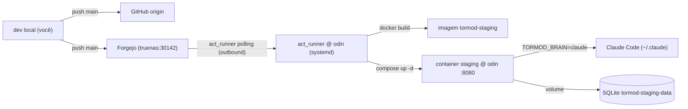

# Tormod — Pipeline de staging (homologação) via Forgejo Actions

Data: 2026-06-11
Status: aprovado (brainstorming) — pronto para plano de implementação

## Objetivo

Levantar um **servidor de homologação local** rodando a **build de produção** do Tormod (sem dev mode), atualizado por um **pipeline de CI/CD no Forgejo**, para testes longos (vários dias) do app real — enquanto o desenvolvimento segue em paralelo no dev server.

Como qualquer staging exige a build de produção (front `vite build` servido same-origin pelo back, em container), **este trabalho entrega o Plano 5** (Docker + produção) como subproduto. Falta só o WireGuard/HTTPS de borda para a exposição pública, que fica para depois.

## Por que isto importa
O dev server (`vite dev` + `node`) roda React **não-minificado** com **StrictMode** (render em dobro) — pesado por natureza. A homologação precisa do build real para avaliar performance e estabilidade honestas, e para deixar o app no ar por dias.

## Decisões (com porquês)

| Decisão | Escolha | Porquê |
|---|---|---|
| Topologia repo | **Push pros dois** (GitHub + Forgejo) | Forgejo Actions dispara em push real; GitHub segue como portfólio. Pull-mirror não aciona Actions de forma confiável. |
| Mecanismo CI | **Forgejo Actions + `act_runner`** | CI nativo do Forgejo; o runner serve qualquer projeto futuro do lab. (Alternativa descartada: webhook+script — menos pipeline.) |
| Runner + staging | **No odin** | A app precisa do `~/.claude` + chaves SSH que vivem no odin; o odin já tem Docker. Build e deploy locais, sem SSH cross-node. |
| Runtime | **Container Docker** (imagem de produção) | Isolamento; é o Plano 5 de deploy; odin já roda Docker. |
| Gatilho do deploy | **Push na `main`** | `main` = o que está em homologação. Promove-se mergeando `feat/web-ui` → `main`. |
| Cérebro do staging | **Claude real** | É o app de verdade operando o homelab — o ponto do homolog de vários dias. |
| Convivência | **Portas/DB/usuário separados** | Dev (5173/8790) e staging (8080) coexistem sem colisão. |

## Topologia do repositório

- O repo local ganha um 2º remote `forgejo` → `forgejo:antonioisaacvd/tormod.git`
  (usa o alias SSH `forgejo` do `~/.ssh/config` — já encapsula host `192.168.0.126`, porta `30143`, user `git`, chave `id_ed25519_forgejo`). Criar antes o repo `antonioisaacvd/tormod` no Forgejo do truenas.
- `origin` (GitHub, `antonioisaacdias/tormod`) permanece intacto.
- Promover para homologação = `git push forgejo main`. O push na `main` do Forgejo dispara o workflow.
- **`main` representa o que está em homologação.** Hoje a `main` está no commit inicial; o primeiro deploy vem de mergear `feat/web-ui` → `main`.

## Arquitetura

## Componentes

### 1. Runner — `act_runner` no odin (infra)
- Instalar o binário `act_runner` no odin; registrar no Forgejo (`http://192.168.0.126:30142`) com token de admin; rodar como **systemd service** (`act_runner.service`), label `odin`.
- **Outbound-only**: o runner faz polling no Forgejo → nenhuma porta nova exposta no odin.
- **Acesso ao Docker socket** (`/var/run/docker.sock`) para buildar a imagem e subir o container.
  - ⚠️ Runner com Docker socket é privilegiado. Mitigação: single-tenant (só nossos repos), local, atrás do WireGuard, não exposto. Registrado apenas neste Forgejo.
- Config do runner: executa o job **no host** (ou em container com o socket montado) — precisa do `docker` CLI disponível no ambiente do job.

### 2. Build de produção (= Plano 5)
- **`Dockerfile`** multi-stage na raiz:
  - **Stage web-build:** `node`, `cd apps/web && npm ci && npm run build` → `apps/web/dist`.
  - **Stage server-build:** `node`, `cd apps/server && npm ci && npx tsc` → `apps/server/dist`.
  - **Stage runtime:** `node:22-slim`, usuário **não-root (uid 1000)**; copia `apps/server/dist` + `node_modules` de produção + `apps/web/dist`; `CMD ["node", "dist/server.js"]`.
- **Hono serve os estáticos** (novo): servir `apps/web/dist` na raiz com **fallback SPA** para `index.html`, mantendo `/api/*` como API e os streams SSE. Em produção não há proxy do Vite — o front chama `/api` same-origin, servido pelo próprio Hono.
  - Implementação: `serveStatic` do `@hono/node-server`; rota catch-all não-`/api` devolve `index.html`.
- **Corrigir os 3 erros de `tsc` do front** (StatusLine `tone="faint"` + `main.tsx` fontsource ×2) — bloqueiam o `npm run build` (`tsc -b && vite build`).

### 3. Workflow — `.forgejo/workflows/staging.yml`
- `on: push: branches: [main]`; `jobs.deploy.runs-on: odin`.
- Passos:
  1. `actions/checkout`.
  2. `docker build -t tormod-staging:latest .`
  3. `docker compose -f compose.staging.yml up -d` (recria o container com a imagem nova; `--no-build`, a imagem já foi buildada no passo 2 — ou o compose referencia `image: tormod-staging:latest`).
- Sem secrets externos (build/deploy locais). A autenticação do runner já está na sua config.

### 4. Container de staging — `compose.staging.yml`
- `image: tormod-staging:latest`
- `ports: ["8080:8790"]` (host 8080 → app 8790 no container).
- `restart: unless-stopped` (sobrevive a reboot → dias de teste).
- `user: "1000:1000"` (não-root, casa com o `odin`).
- **Env:** `TORMOD_BRAIN=claude`, `TORMOD_CWD=/home/odin`, `TORMOD_COOKIE_SECURE=false` (LAN http), `TORMOD_AUDIT=/data/tormod.db`.
- **Montagens:**
  - `~/.ssh:/home/odin/.ssh:ro` (chaves do fleet, read-only)
  - `~/.claude:/home/odin/.claude:rw` (auth + config do cérebro)
  - `tormod-staging-data:/data` (volume nomeado para o SQLite — **persiste entre deploys**, então usuário/sessões sobrevivem ao redeploy).
- Sem socket Docker montado no container da app (só o runner tem).

### 5. Primeiro acesso
- DB próprio (volume novo) → no 1º acesso o staging mostra a tela de **cadastro**; cria-se um **usuário de homologação** (separado do dev).

## Convivência dev ↔ staging
- **Dev:** `vite dev` (5173) + `node dist/server.js` (8790) — segue como está.
- **Staging:** container na **8080**, DB próprio no volume, usuário próprio.
- ⚠️ Ambos compartilham o `~/.claude` do odin. Criam sessões Claude **distintas** (ok), mas **não retomar a mesma sessão `.jsonl` nos dois** ao mesmo tempo (corrida de escrita) — disciplina operacional, não bloqueio.

## Segurança
- Runner outbound-only, single-tenant, atrás do WireGuard; Docker socket só no runner.
- Container da app **não-root**, `~/.ssh` read-only, **sem** socket Docker, cookie de sessão (auth single-user + 2FA já implementados) — `TORMOD_COOKIE_SECURE=false` só porque é LAN http; quando ganhar HTTPS de borda, vira `true`.
- Staging é **LAN/VPN apenas** (porta 8080 não exposta à internet) — a 2FA adaptativa trata como origem local (só senha), coerente.

## Fora de escopo (desta spec)
- WireGuard/HTTPS de borda para exposição pública (fase seguinte do Plano 5; o invariante "só acessível de fora via proxy confiável" da auth-design vale quando isso for feito).
- Registry de imagens (build local, sem push para registry).
- Testes automatizados no CI (lint/test gates) — o foco aqui é build + deploy; gate de testes pode ser uma fase posterior.
- Migração do `origin` para o Forgejo (mantém-se GitHub como primário).

## Fases da implementação (resumo — detalhe vai no plano)
- **Fase A — Build de produção (Plano 5 core):** corrigir os 3 erros de `tsc`; Hono servindo estáticos + fallback SPA; `Dockerfile` multi-stage; `compose.staging.yml`. Validável local (`docker build` + `docker run`) **antes** de qualquer CI.
- **Fase B — Runner Forgejo:** criar o repo no Forgejo + remote; instalar/registrar `act_runner` no odin (systemd).
- **Fase C — Workflow + deploy:** `.forgejo/workflows/staging.yml`; push de teste na `main`; validar build+deploy+acesso em `192.168.0.10:8080`.

## Critérios de aceite
- `docker build .` produz uma imagem que sobe e serve o front em `/` e a API em `/api` same-origin, sem Vite.
- Push na `main` do Forgejo dispara o Action, que reconstrói e redeploya o container, e a nova versão aparece em `http://192.168.0.10:8080`.
- O staging sobrevive a um reboot do odin (restart: unless-stopped) e mantém usuário/sessões (volume).
- Dev (5173/8790) continua funcionando sem interferência.
