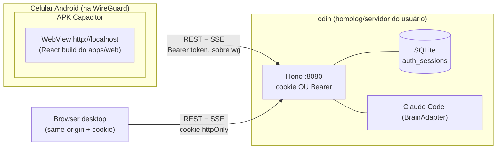

# Tormod — App mobile via Capacitor (cliente desacoplado + auth por token)

Data: 2026-06-13
Status: aprovado (brainstorming) — pronto para plano de implementação
Marco de versão: **0.5.0** (token seam + app mobile instalável)

## Objetivo

Entregar um **app Android instalável** que opera o homelab pelo celular sobre a
WireGuard, **reaproveitando o mesmo codebase React** do `apps/web`:

- A UI React atual é **empacotada com [Capacitor](https://capacitorjs.com)** como um
  APK nativo — zero reescrita de UI.
- O app é um **cliente desacoplado**: no 1º acesso o usuário **digita o endereço do
  servidor** Tormod; o app conversa com ele direto (`http://<host>:porta` sobre a wg).
- A autenticação carrega a sessão por **`Authorization: Bearer <session id>`** (token),
  porque cookie não funciona cross-origin. **As credenciais (user + senha + TOTP) não
  mudam** — muda só o transporte da sessão depois do login.
- O **app web continua idêntico** (servido same-origin pelo Hono, sessão por cookie).
  Um codebase React, **dois alvos de build**.

## Contexto e restrições

- **Shape:** o `apps/web` (React 19 + Vite + Tailwind) já é uma SPA polida (chat,
  sessões, cards de aprovação, work-balloon, streaming, settings, auth). O backend
  Hono já tem auth single-user stateful ([2026-06-11-tormod-auth-design.md](2026-06-11-tormod-auth-design.md)):
  a tabela `auth_sessions` emite **ids opacos** de sessão. O token do mobile **é** esse id,
  entregue no header em vez de cookie.
- **Rede:** o Tormod é alcançável pela wg em `10.0.0.10:8080` e pela LAN em
  `192.168.0.10:8080` (homolog). Confirmado: a wg **só roteia `10.0.0.0/24`** e não há
  DNS local nos clientes → não existe um origin único de graça. App nativo + endereço
  digitado contorna isso sem DNS/TLS.
- **Segurança de transporte:** o tráfego HTTP do app vai **criptografado pela wg**.
  HTTP puro dentro do túnel é aceitável; **TLS deixa de ser pré-requisito** (some o
  sub-projeto DNS/cert/Caddy/wg-always-on que um PWA exigiria).
- **Audiência do produto:** self-host por terceiros (cada um roda o próprio servidor,
  um por instância). Multi-server num app só é **fora de escopo** (YAGNI; cada
  estranho self-hosta o seu).

## Por que Capacitor (e não PWA nem Flutter)

| Caminho | Veredito | Porquê |
|---|---|---|
| **PWA same-origin** | rejeitado p/ mobile | Android exige **HTTPS + service worker** pra instalar (WebAPK), e página HTTPS não fala com backend HTTP (**mixed content**). Forçaria toda a infra de TLS/DNS. |
| **Flutter nativo** | rejeitado | "Manter o web" + Flutter = **3 codebases** (React web + Dart mobile + backend). Reescreve toda a UI em Dart; UI de chat/listas não aproveita o feel nativo. Fora da stack. |
| **Capacitor** | **escolhido** | Empacota o **mesmo React** como APK. Casca nativa **não obedece** às travas do browser (secure-context/mixed-content) → fala `http://IP` sobre a wg. Reusa 100% da UI. Push nativo (FCM) no futuro. |

**Retrabalho se um dia migrar pra Flutter:** só a **casca fina** (config + adapters +
projeto `android/`) é descartada. O **backend (token/CORS/endereço)** é reaproveitado
por qualquer cliente nativo, e a reescrita de UI em Dart seria custo de Flutter de
qualquer jeito (não é custo extra do Capacitor). Decisão de **baixo arrependimento**.

## Decisões (com porquês)

| Decisão | Escolha | Porquê |
|---|---|---|
| Tipo de cliente mobile | **Capacitor (wrap do React)** | Reusa a UI; escapa das travas de browser; pronto pra desacoplar/produtizar. |
| Web vs mobile | **manter os dois, 1 codebase** | Capacitor empacota o mesmo build; feature nova entra uma vez. |
| Transporte de auth no mobile | **`Authorization: Bearer <session id>`** | Cookie não vai cross-origin (SameSite). O id opaco de `auth_sessions` vira o token. |
| Credenciais | **inalteradas** (user+senha+TOTP) | Token só substitui o cookie; cadastro/login/2FA/Argon2id seguem iguais. |
| Backend | **token aditivo ao cookie** | Web segue cookie same-origin; mobile usa Bearer. Mesma `auth_sessions`. |
| CORS | **liberar a origem nativa** (`http://localhost`) | Requisição cross-origin do WebView ao backend; preflight do header `Authorization`. |
| Esquema do WebView | **`androidScheme: 'http'`** | `http://localhost` é secure context (exceção do Chromium) **e** http→http **não é mixed content** → `fetch` normal faz streaming de SSE. (ver Risco crítico) |
| Endereço do servidor | **1 servidor, campo único, persistido** | YAGNI; storage modelado p/ virar lista depois sem quebrar. |
| Cleartext Android | **liberar via network-security-config** | Android ≥ API 28 bloqueia HTTP por padrão; whitelist do host/subnet. |
| Push | **fora de escopo (fase 2 / 0.6.0)** | Aditivo; tem decisão própria (FCM vs ntfy/UnifiedPush) por critério de confiança da infra. |

## Risco crítico: SSE dentro do WebView

O SSE é o coração do Tormod (stream de eventos do cérebro). No Capacitor há uma
armadilha que **precisa ser validada antes de tudo**:

- Se a casca for servida em **`https://localhost`** (default novo do Capacitor), o
  `fetch` pra `http://10.0.0.10:8080` é **mixed content → bloqueado** pelo WebView.
- **`CapacitorHttp`** (que roteia requisições pela camada nativa, furando CORS e
  mixed-content) **historicamente não suporta streaming** → mataria o SSE.

**Mitigação (decisão de design):** servir a casca em **`http://localhost`**
(`androidScheme: 'http'`):

- `localhost` é **secure context** mesmo sobre http (exceção do Chromium; e o
  Capacitor não precisa de service worker).
- http (casca) → http (backend) **não é mixed content**.
- O **`fetch` normal do WebView faz streaming** → reusa o fetch-reader que o
  `apps/web` já tem (SSE via `ReadableStream` com header `Authorization`).
- Custo: a chamada vira **cross-origin** → o backend ganha **CORS** pra origem
  `http://localhost` (preflight por causa do `Authorization`).

→ A implementação **começa por um spike** que prova o streaming de SSE no WebView com
esse esquema, **antes** de construir o resto. É o gate de viabilidade.

## Arquitetura



**Invariante preservado:** o servidor é o produto; o cérebro é cliente. O gate de
permissão (cards de aprovação) e o audit seguem **idênticos** — o app mobile é só mais
um transporte pra mesma API.

## Componentes e fronteiras

### a) Backend — token aditivo ao cookie

Mudança **pequena e aditiva** em `apps/server/src/http/auth.ts`:

- **`sessionMiddleware`**: aceitar o session id do **cookie OU** do header
  `Authorization: Bearer <id>`. Hoje: `const id = getCookie(c, COOKIE)`. Vira:
  `const id = bearer(c) ?? getCookie(c, COOKIE)`. Validação (`sessions.validate`)
  inalterada.
- **`/api/auth/login` e `/register`**: quando o cliente sinaliza modo-token (header
  `X-Tormod-Client: native`), **retornar `{ ok, token: <session id> }` no corpo**
  além de validar igual. A sessão é a **mesma linha** de `auth_sessions`.
- **CSRF**: o gate `X-Tormod: 1` em `/api/auth/*` é defesa pra cookie; o cliente
  nativo manda o header igual. (Bearer não sofre CSRF, mas manter o header é trivial.)
- **CORS**: middleware liberando a origem `http://localhost` (a origem do WebView),
  com `Authorization` nos headers permitidos. Web same-origin não é afetado.
- **Origem/2FA**: inalterado — o IP do cliente (wg `10.0.0.x`) cai nos CIDRs
  confiáveis → só senha. A lógica de TOTP-no-externo continua reusável.

Esta é a peça **durável**: qualquer cliente nativo futuro (inclusive Flutter)
autentica assim.

### b) Front — camada de API/auth ciente de plataforma

Localizado em `apps/web/src/lib/api.ts` + `lib/auth.ts` (que já centralizam REST+SSE):

```
isNative = Capacitor.isNativePlatform()
apiBase  = isNative ? `${serverUrl}/api` : '/api'          // web: relativo same-origin
// web:    credentials: 'include' (cookie)
// nativo: header Authorization: Bearer <token>, credentials: 'omit'
```

- O SSE já é **fetch-reader com header `Authorization`** (não EventSource) → porta
  direto pro modo token; web continua mandando o cookie automaticamente.
- **Componentes de UI não mudam.**
- Token + serverUrl persistidos via `@capacitor/preferences` (single-user homelab;
  upgrade pra secure-storage é melhoria futura).

### c) Front — tela de "endereço do servidor" (só nativo)

- 1ª abertura sem servidor salvo → tela **"Conectar ao servidor"**: campo único de URL
  (ex.: `http://10.0.0.10:8080`).
- Valida chamando **`GET <url>/api/auth/status`** (prova alcançabilidade + retorna
  `registered`/`external`/`totpEnabled`).
- Sucesso → guarda a URL → cai na **`AuthGate`** normal (cadastro se `!registered`,
  senão login) **em modo-token** contra aquela URL.
- No web essa tela **nunca aparece** (same-origin). URL editável depois (trocar
  servidor em Settings / no logout).

### d) Casca Capacitor

- `apps/web/capacitor.config.ts` + projeto `apps/web/android/` (co-localizados, pois
  empacotam o build do web).
- `androidScheme: 'http'` (ver Risco crítico).
- `network_security_config.xml` liberando cleartext pro host/subnet da wg.
- Ícones, splash, nome do app, `versionName`/`versionCode` (Android exige `versionCode`
  inteiro monotônico a cada release; `versionName` = a string SemVer).
- Build: `vite build` → `npx cap sync android` → APK via Gradle/Android Studio.

### e) Distribuição

- **Sideload** do APK **assinado** (release keystore) no celular do usuário (adb /
  transferência de arquivo).
- F-Droid / Play Store = **futuro, fora de escopo**.

## Fluxo de dados (mobile)

1. App abre → lê `{ serverUrl, token }` do storage.
2. Sem `serverUrl` → tela de servidor → valida via `/api/auth/status` → guarda.
3. Token válido (`GET /api/auth/me` 200) → entra no app.
4. Senão → `AuthGate`: cadastro ou **login (user+senha[+TOTP])** → backend retorna
   `token` → guarda.
5. Daqui pra frente todo REST + SSE usa `serverUrl` + `Authorization: Bearer`.

## Faseamento

- **Spike 0 — viabilidade do SSE no WebView.** Casca Capacitor mínima com
  `androidScheme: 'http'` + CORS no backend; provar que o SSE streama no WebView
  contra o homolog. **Gate**: se não streamar, reavaliar (plugin SSE nativo).
- **A — Backend.** Bearer no `sessionMiddleware` + `login`/`register` retornando token
  + CORS pra origem nativa. Testes vitest (caminho cookie **e** token).
- **B — Front.** Seam de plataforma (`apiBase`/auth) + tela de endereço de servidor +
  validação de URL. Testes da lógica pura de seleção de modo/validação.
- **C — Capacitor.** Projeto `android/`, scheme/cleartext, ícones, build do APK
  assinado, instalar no celular, **e2e vivo sobre a wg** (cadastro → login → sessão →
  card de aprovação → arquivo criado).

## Testes

- **Backend:** unit (vitest) — `sessionMiddleware` aceitando Bearer; `login`/`register`
  retornando token; CORS liberando a origem nativa e barrando outras.
- **Front:** unit — função pura de seleção de modo (apiBase/headers/credentials) e
  validação da URL do servidor.
- **E2E:** manual no spike e na fase C — APK no celular real, sobre a wg. (Playwright é
  web-only; e2e nativo automatizado = fora de escopo.)

## Fora de escopo (explícito)

- **Push/FCM** (fase 2 / 0.6.0 — decisão própria: FCM vs ntfy self-hosted vs
  UnifiedPush, por critério de confiança de infra).
- **Multi-server** num app só (storage fica extensível, mas a UI é de 1 servidor).
- **iOS**, **app stores**, **OTA live-updates**.
- **TLS/HTTPS** no backend (a wg já criptografa; só voltaria a importar pra acesso web
  externo fora do túnel).

## Riscos e mitigações

| Risco | Mitigação |
|---|---|
| SSE não streama no WebView | **Spike 0** valida antes; fallback = plugin SSE/HTTP nativo. |
| `androidScheme: 'http'` quebra algo do WebView | `localhost` segue secure context; Capacitor não usa service worker. Validado no spike. |
| Token em `Preferences` (não secure-storage) | Aceitável p/ single-user homelab; upgrade futuro a secure-storage. |
| Esteira de APK nova (SDK/keystore/Gradle) | Documentar setup; é custo único, isolado da casca fina. |
| Cleartext liberado amplo demais | Restringir o `network-security-config` ao host/subnet da wg, não global. |
